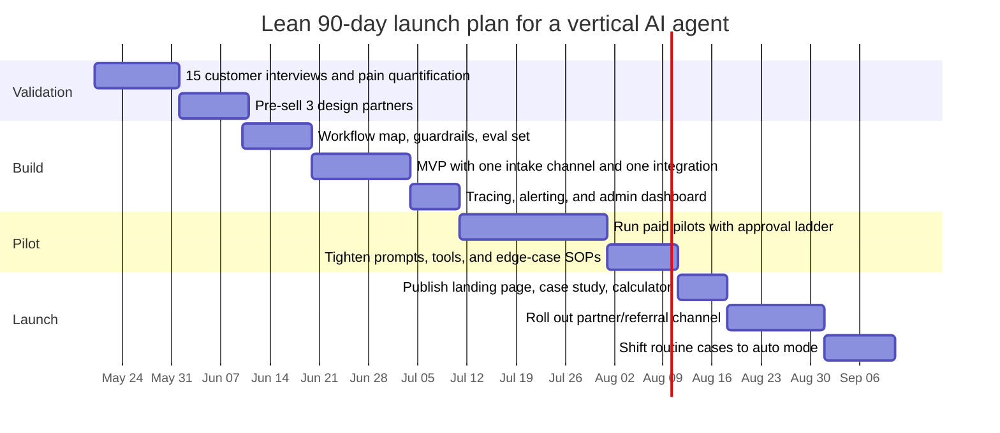

# Hands-Off AI Agent Businesses

## Executive summary

"Passive income" from AI agents is mostly a bad marketing phrase. The real opportunity is **low-touch recurring income** from narrow, measurable workflow agents that need **supervision, alerts, and periodic tuning**, not zero oversight. The evidence is strongest in customer operations, lead capture, scheduling, revenue-cycle admin, procurement monitoring, and document-heavy back office work. McKinsey estimates about **75% of generative AI's value** sits in customer operations, marketing and sales, software engineering, and R&D. In its 2025 survey, **88%** of respondents said their organizations use AI in at least one business function, but only about **one-third** had begun scaling AI across the enterprise; **23%** said they were scaling agentic AI somewhere in the business and another **39%** were experimenting. Anthropic's 2025 Economic Index found **77% of first-party API business use** was automation-dominant. PwC found industries most exposed to AI had **3x higher growth in revenue per employee** versus the least exposed industries from 2018–2024.

The best agent businesses today do **not** look like fully autonomous general bots. They look like "digital labor" for one boring headache: recovering leads after hours, chasing vendor certificates, monitoring bid portals, processing returns, or handling routine shipment exceptions. Podium's local-business AI agents are a strong signal: Podium says it has deployed **tens of thousands** of agents, seen **300% year-over-year AI revenue growth**, and that for customers those agents drive a **30% average revenue increase** and **45% increase in lead conversion**. Podium also found roughly **40% of inquiries arrive after hours**, and that top converters responded in about **two minutes** while the typical response was over **two hours**. That is exactly the kind of measurable pain a small founder can productize.

There is also evidence that profitable small operators exist. Public audited profit data for AI agent businesses is still sparse, but marketplace examples are revealing: Acquire.com highlighted an **AI Sales Agent SaaS** listing at **$2.2M TTM revenue / $1.0M TTM profit**, a **conversational AI appointment booking** business at **$2.0M TTM revenue / $793K TTM profit**, an **AI prospecting and sales automation** SaaS at **$580K TTM revenue / $460K TTM profit**, and an **AI automation agency** at **$880K TTM revenue / $430K TTM profit**. Acquire's 2026 multiples report says profitable SaaS sold at a **median 3.9x profit multiple** in both 2024 and 2025. Those are marketplace listings rather than audited public-company statements, but they are the clearest public evidence that lean, sellable AI-automation businesses are already being built.

The biggest strategic error is trying to be too autonomous too early. OpenAI's own guidance says agents work best when they target workflows with **complex decisions, hard-to-maintain rules, or lots of unstructured data**, and it explicitly recommends **starting with a single agent** and adding multi-agent complexity only when needed. It also says human intervention should remain in the loop when the agent **exceeds failure thresholds** or takes **high-risk actions** such as payments or large refunds. Anthropic's Project Vend is the clearest cautionary case: its Claude-run vending experiment **did not succeed at making money**, sold items at a loss, hallucinated payment details, and gave away discounts too freely.

If I were optimizing for the combination of **feasibility, low ongoing labor, and revenue quality**, I would start with one of these three wedges:

| Best first bets | Why they win | Best pricing |
|---|---|---|
| **Vendor certificate and license renewal monitor** | Deeply boring, recurring, document-heavy, low real-time risk, high retention potential | Subscription by portfolio, location, or vendor count |
| **After-hours lead capture and booking agent** | Clear ROI, fast sales cycle, proven SMB pain, easy pilot | Subscription per location plus optional per-booked-job fee |
| **RFP/RFQ monitoring and go/no-go agent** | Extremely painful manual workflow, high willingness to pay, low support burden | Subscription plus premium draft-response tier |

Those three ideas are the closest thing to "passive" in this space because they combine recurring need, low operational risk, and light support. The report below explains why.

## Market landscape and recent case studies

The market is moving from "AI can answer questions" to "AI can complete work." In business, that means budgets are shifting toward **systems that take action across tools**, not just copilots. OpenAI defines an AI agent as a system that can **plan, decide, and act independently** toward a goal, while Anthropic's research shows business API use skewing strongly toward automation rather than brainstorming. That is a useful distinction, because the strongest business cases are not generalized chat experiences; they are workflow completion products.

The highest-confidence demand zones are the ones where labor is repetitive, rules are messy, data is semi-structured, and outcomes can be measured in cash, speed, or reduced staffing. McKinsey's value concentration across customer operations, marketing/sales, software, and R&D supports this. McKinsey's 2025 survey also shows a market that is **real but not mature**: adoption is broad, scaling is still limited, and agentic systems are early enough that smaller founders can still win in narrow verticals before incumbents fully close the gaps.

### Recent case studies with documented traction

| Business | What it sells | Documented traction | What the case implies for you |
|---|---|---|---|
| **Intercom Fin** | AI support agent | Intercom started experimenting within hours of GPT-3.5's release and launched Fin four months later; OpenAI says Fin now resolves **millions of customer queries each month**. Intercom prices Fin at **$0.99 per outcome** for resolutions/procedure handoffs/disqualifications and **$9.99** for qualifications. | High-value workflow agents can be priced by **resolved outcome**, not by seats alone. |
| **Salesforce Agentforce** | Enterprise "digital labor" platform | Reuters reported Salesforce had closed **more than 1,000 paid Agentforce deals** by Dec. 2024. Salesforce's own pricing page lists **$2 per conversation** or **$500 per 100k Flex Credits**. | Outcome- or action-based pricing is acceptable when the buyer already understands workflow economics. |
| **Podium** | SMB lead capture and service agents | Podium says it has deployed **tens of thousands of agents**, seen **300% YoY AI revenue growth**, and that the agents influence **billions in revenue**. It reports **30% average revenue uplift** and **45% lead-conversion improvement** for customers. | Local SMB pain is large, under-served, and monetizable when the agent is directly tied to booked jobs or recovered leads. |
| **Sierra** | Enterprise customer service agents | Reuters reported Sierra had crossed **$20M annualized revenue** by Oct. 2024; TechCrunch later reported Sierra reached **$100M ARR in under two years**. | Customer-service agents are one of the fastest-scaling categories when paired with enterprise integrations. |
| **Ramp** | Autonomous finance workflows | TechCrunch reported Ramp became **cash-flow positive** in 2025, had hit **$700M annualized revenue**, and launched its first agent while pushing an "autonomous finance" strategy. | Finance-adjacent agents are attractive when they sit inside an existing SaaS platform with trusted data and clear ROI. |
| **Commure** | Agentic healthcare admin | Reuters reported Commure's revenue-cycle-management platform completes **more than 85% of work without human intervention** and is deployed across **500+ healthcare organizations and 3,000 sites**. | Regulated admin-heavy verticals are huge, but they demand serious compliance and domain depth. |
| **Acquire.com AI Sales Agent SaaS listing** | AI sales automation | **$2.2M TTM revenue / $1.0M TTM profit**, 500–1000 customers, 200%+ YoY growth. | Small, focused AI automation products can already be strongly profitable. |
| **Acquire.com conversational AI appointment-booking listing** | Appointment booking automation | **$2.0M TTM revenue / $793K TTM profit** with 172% growth. | Scheduling/booking remains one of the cleanest monetization wedges for agents. |
| **Acquire.com AI prospecting/sales automation listing** | Lead generation automation | **$580K TTM revenue / $460K TTM profit** and 1,000%+ YoY growth. | Narrow sales workflows can be very profitable with a lean team and low service burden. |
| **Acquire.com AI automation agency listing** | Hybrid SaaS + services | **$880K TTM revenue / $430K TTM profit** with recurring retainers and SOPs. | A services-first wedge can work if it is systematized and later productized. |

Two important caveats matter. First, the high-growth venture-backed winners often report **ARR, deployments, or customer wins**, not audited profit. Second, runaway growth can hide terrible economics: Reuters reported Cursor reached **$100M recurring revenue** in under two years but that it and Windsurf were operating with **negative gross margins**. That is the cleanest public warning against building a commodity "AI coding agent" clone and underpricing tokens.

The actionable conclusion is blunt: **don't chase the flashiest category; chase the ugliest recurring workflow**. The public evidence says cash is clustering where agents replace fragmented admin work with visible ROI, not where they merely sound impressive.

## Monetization and operating models

The best monetization matches the workflow's economic unit. If the customer care agent saves a support team money, price by resolution, conversation, seat, location, or queue volume. If the workflow directly produces cash, price as a subscription plus revenue share. If the workflow is mostly monitoring, price by portfolio size, number of vendors, number of locations, or number of watched sources. Intercom and Salesforce are useful anchors here because both moved beyond classic seat pricing: Intercom charges by **outcome**, while Salesforce offers both **per-conversation** and **per-action/credits** models.

### Monetization models that fit agent businesses

| Model | Best fit | Why it works | Main weakness | Good real-world signal |
|---|---|---|---|---|
| **Subscription SaaS** | Monitoring, compliance, knowledge, repeatable ops | Predictable; easy to forecast; easiest to sell to SMBs | Misprices heavy users unless tightly scoped | Most profitable small listings on Acquire use recurring SaaS-style pricing. |
| **Usage or outcome fees** | Support, booking, claims, qualification | Best alignment between cost and customer value | Can scare buyers if costs feel open-ended | Intercom's **$0.99/outcome** and Salesforce's **$2/conversation**. |
| **Revenue share** | Booked jobs, collections, recovered freight claims, recovered AR | Very strong close rate when ROI is obvious | Attribution disputes; cash collection complexity | Works best as **base fee + percentage**, not pure rev share. |
| **Lead generation / pay-per-qualified-lead** | Local services, brokers, contractors, agencies | Easy customer story: "pay for booked revenue" | Needs careful lead-quality definition | Podium's conversion and revenue-lift metrics support this wedge. |
| **Licensing / white-label** | Agencies, vertical SaaS partners, consultants | Fast scale through channels; lower CAC | Lower margin per customer; partner dependence | Strong fit for niche workflow agents embedded by resellers. |
| **Affiliate / advertising** | Research agents, buying guides, comparison engines | Most passive once content/distribution compounds | Weak moat; platform and SEO risk | Best as a secondary model, not the core one. |
| **Hybrid SaaS + services** | Early-stage founder validating a niche | Cash today, product insights tomorrow | Harder to make truly hands-off | Acquire's AI automation agency case shows this can still be profitable. |

The operating model matters just as much as pricing. For "passive-ish" operation, the trick is to separate **low-risk autonomous actions** from **high-risk irreversible actions**. OpenAI's practical guide explicitly says high-risk actions should stay under human oversight until reliability is proven, and Anthropic's Project Vend shows why that matters. A small founder should therefore think in **approval ladders**, not in binary "autonomous/not autonomous" terms.

### Operating models for low-touch operation

| Model | What runs automatically | Human role | Best use | Reality check |
|---|---|---|---|---|
| **Mostly autonomous** | Monitoring, classification, reminders, summaries, routine scheduling | Weekly audits; failure alerts only | Compliance monitors, bid watchers, review-response drafts | This is the closest to passive. |
| **Human-in-the-loop minimal ops** | Most triage and drafting; approvals for irreversible actions | Approve refunds, payments, escalations, high-dollar actions | Returns, invoice chasing, freight claims, vendor dispatch | Usually the best first production model. |
| **Outsourced maintenance** | Agent handles 80–95% of work; a VA/BPO handles exception queue | Founder owns QA and product, not daily handling | Once you have 20+ customers and standardized edge cases | Excellent for making a services wedge feel product-like. |

A strong rule of thumb is this: **fully autonomous only for workflows where a weird answer is annoying, not expensive**. Anything that can create legal exposure, compliance exposure, money movement, or reputation damage should start with approvals.

## Tech stack, tooling, and unit economics

For a small founder, the ideal stack is **boring infrastructure plus flexible agent tooling**. You want one capable model for hard decisions, one cheaper model for routing/classification, a durable event log, a memory/retrieval layer only when needed, and tracing/evals from day one. OpenAI's Agents SDK is strongest when your server owns orchestration, tool execution, approvals, and state; LangSmith and Phoenix are built around observability and evaluation; Microsoft's Agent Framework and Foundry Agent Service are the most enterprise-centered options if you want managed infrastructure and long-running workflows.

### Model choices for a lean vertical-agent stack

| Model | Official price | Best use | Why use it |
|---|---|---|---|
| **OpenAI GPT-4.1 mini** | **$0.40 / 1M input tokens; $1.60 / 1M output tokens** | Default model for extraction, routing, templated decisions, and medium-complexity workflows | Very attractive cost/performance for high-volume agent work. |
| **OpenAI GPT-4.1** | **$2.00 / 1M input; $8.00 / 1M output** | Harder decisions, reliable tool calling, nuanced policy logic | Good "upgrade path" when mini isn't enough. |
| **OpenAI GPT-4o mini** | **$0.15 / 1M input; $0.60 / 1M output** | Cheap classification, basic extraction, narrow text work | Good for routers and pre-filters. |
| **Anthropic Claude Haiku 4.5** | **$1 / MTok input; $5 / MTok output** | Fast triage, summarization, low-stakes automations | Cheap enough for high-volume use with good quality. |
| **Anthropic Claude Sonnet 4.6** | **$3 / MTok input; $15 / MTok output** | Heavier reasoning, long-context review, harder document work | Strong default for harder enterprise-like workflows. |

A useful mental model is to design for **cheap-by-default, expensive-on-escalation**. For a moderate workflow using roughly **15k input tokens and 2k output tokens**, the pure model cost is about **$0.0092** on GPT-4.1 mini, about **$0.046** on GPT-4.1, about **$0.025** on Claude Haiku 4.5, and about **$0.075** on Claude Sonnet 4.6. That means even 10,000 such runs per month can be surprisingly cheap on smaller models and surprisingly expensive on premium models. The lesson from the coding-agent market is clear: revenue can soar while gross margins still break if you get pricing wrong.

### Orchestration and platform choices

| Layer | Strong choices | Best when | Key tradeoff |
|---|---|---|---|
| **Code-first orchestration** | OpenAI Agents SDK; LangGraph; Microsoft Agent Framework | You want explicit control, approvals, branching logic, and custom state | More engineering effort, but stronger moat and lower lock-in. |
| **Managed agent hosting** | Microsoft Foundry Agent Service | You want managed deployment, model choice, and enterprise controls | More cloud/platform dependence. |
| **No-code / low-code orchestration** | n8n, Gumloop, Zapier Agents, Make AI Agents | You want to launch fast with small budgets and lots of app integrations | Higher long-term platform dependence and sometimes weaker testing discipline. |
| **Observability and evals** | OpenAI tracing, LangSmith, Phoenix | You care about debugging, regression testing, and customer trust | You must actually review traces and close the loop. |
| **Knowledge / memory** | Neon/Supabase Postgres; Pinecone when scale/search quality justify it | You need workflow history, retrieval, or document memory | Don't add vector infra until simple retrieval stops being enough. |
| **Hosting** | Vercel, Cloud Run, Modal | Vercel for app UI, Cloud Run for serverless backends, Modal for spiky or GPU-heavy compute | Pick the simplest thing that matches your workload shape. |

### Indicative stack costs for a solo founder

A credible MVP can be built very cheaply now. Official pricing pages show **Vercel Pro at $20/month**, **n8n Starter at €20/month**, **Gumloop Pro at $37/month**, **Neon Launch with typical spend around $15/month**, **text-embedding-3-small at $0.02 per million tokens**, and Cloud Run billing by CPU, memory, and request. Pinecone becomes relevant when you want managed vector search at scale, but a lot of early vertical-agent products can live on ordinary Postgres plus well-structured metadata.

The practical implication is that most founder-built vertical agents should aim for this cost ladder:

| Stage | Typical stack | Likely monthly infra + model spend |
|---|---|---|
| **Prototype** | n8n or simple Python app + Postgres + one model | **$50–$300** |
| **Early MVP** | App UI + API backend + tracing + database + one premium model for escalations | **$200–$1,000** |
| **Stable small business** | Multi-tenant app + observability + evals + low-cost default model + outsourced exception queue | **$800–$4,000** |
| **Scaled operator** | Multiple agent workflows, partner channels, QA layer, canary testing | **$3,000–$15,000+** |

That cost structure is why "boring" B2B agents can work: the gross-margin profile is attractive **if** your default model is cheap, your workflow is narrow, and you don't offer expensive unlimited plans to power users.

## Legal, ethical, and compliance constraints

If your goal is low-touch income, legal and compliance discipline is not optional. It is the difference between a durable boring business and a self-inflicted mess. The EU AI Act is now the world's first comprehensive AI framework and uses a **risk-based** structure for AI developers and deployers. NIST's AI Risk Management Framework is still the best high-level operating framework for identifying and reducing AI risks to people, organizations, and society.

Data protection is the first real constraint. The UK ICO's AI guidance remains a useful benchmark: if your agent touches personal data, you need a lawful basis, data-minimization discipline, retention limits, and a real story for accuracy, access, and deletion. In practical terms, that means choosing workflows where you can keep the data scope narrow, redact or mask sensitive fields, minimize log retention, and provide customers with audit trails. This is one reason the best "passive" businesses often live in workflow monitoring and document chase-down, not in intimate consumer advice or broad autonomous decision-making.

Consumer-protection law matters just as much as privacy. The FTC's "Operation AI Comply" made clear there is **no AI exemption** from unfair or deceptive practices law. The FTC has also brought cases against AI hype and business-opportunity schemes, including storefront/passive-income offers and claims that AI products can substitute for professional expertise without evidence. In 2025–2026, the FTC's AI page also highlighted enforcement around misleading earnings claims, AI-powered ecommerce opportunity schemes, and the settlement that would ban Air AI from marketing business opportunities. If you build an AI-agent business, do **not** market it with guaranteed earnings or magical "set it and forget it" claims.

There are clear "don't start here" categories if you want a hands-off first business. Legal automation is one. The FTC's complaint against DoNotPay centered on unsupported "robot lawyer" claims and the lack of evidence that the service matched professional legal expertise. Hiring is another. The EEOC's guidance explicitly lists recruiting, screening, hiring, productivity monitoring, wage-setting, and related employment processes as activities that can involve AI and trigger employment-law scrutiny. Healthcare admin can work, but it is high-reward and high-friction.

Voice outreach adds another layer of risk. The FCC announced in 2024 that **AI-generated voices in robocalls are "artificial"** under the TCPA. That does not kill all voice agents, but it means outbound calling, consent, recording, and disclosure need real legal review. For a first passive-income business, text, email, portals, ticketing, and workflow monitoring are simply safer.

Intellectual-property law is also not a solved problem. The U.S. Copyright Office's 2025 report says **copyright does not extend to purely AI-generated material** where there is insufficient human control over the expressive elements, and it concludes that **prompts alone** do not currently create enough human control to make users the authors of the output. Its 2025 pre-publication Part 3 report also underscores that AI training on copyrighted works remains an active legal and policy fight. For your business, the safest practical posture is to use licensed data, preserve provenance, avoid scraping where terms prohibit it, and treat generated outputs as something to review and curate—not blindly own.

## High-feasibility business concepts

The ideas below are ranked by a blend of **feasibility, passive-ness, and revenue potential**. The order is intentional: the top of the list is where a solo founder can most plausibly build low-touch recurring revenue without stepping onto a regulatory landmine.

Cost ranges assume a lean stack built from the pricing benchmarks above: small-model defaults, premium-model escalations, serverless hosting, Postgres storage, and either no-code orchestration or a light code-first backend.

### Priority-ranked ideas

| Rank | Idea | Problem solved | Target customers | Monetization | MVP features | Est. build cost | Est. monthly run cost | Time to launch | Scaling path | Feasibility | Passive-ness | Revenue potential |
|---|---|---|---|---|---:|---:|---:|---|---|---|---|---|
| **Top** | **Vendor certificate and license renewal monitor** | Teams waste hours chasing expiring insurance certificates, vendor licenses, W-9s, and permits | Property managers, GCs, franchises, facilities teams | $299–$699/mo per portfolio + onboarding | Shared inbox; expiry extraction; reminder cadences; vendor upload links; status dashboard; audit export | $4k–$12k | $150–$500 | 3–5 weeks | White-label through brokers, PM software consultants, franchise consultants | High | High | High |
| **Top** | **After-hours lead capture and booking agent** | Revenue leaks when SMBs miss calls/chats after hours or reply too slowly | HVAC, plumbers, med spas, dentists, auto shops | $249–$499/location/mo + optional booked-job fee | Website chat/SMS intake; FAQs; qualification; calendar booking; CRM sync; daily digest | $3k–$10k | $250–$700 | 2–4 weeks | Agency white-label, telco/CRM partnerships, template library | High | High | High |
| **Top** | **RFP/RFQ watch and go/no-go agent** | Teams manually scan portals and miss deadlines or waste time on bad-fit bids | Agencies, MSPs, specialty manufacturers, subcontractors | $399–$999/mo + premium draft-response tier | Source monitoring; semantic matching; scorecard; deadline reminders; Slack/email summaries | $4k–$14k | $300–$900 | 2–4 weeks | Vertical-specific tender data, channels via procurement consultants | High | High | High |
| **Top** | **Freight exception and reimbursement claims agent** | Shipment delays, exceptions, and refund claims are repetitive and easy to neglect | E-commerce brands, 3PLs, distributors | $299–$599/mo + % of recovered claims | Carrier-status monitoring; anomaly detection; customer updates; claim packet drafting; dashboard | $5k–$15k | $300–$1,000 | 4–6 weeks | Add WMS/ERP connectors; partner with ops agencies and 3PL consultants | High | High | Medium-high |
| **Top** | **Returns and warranty triage agent** | Support teams burn time on repetitive return/warranty flows, and policy compliance is messy | DTC brands, electronics, outdoor gear, parts sellers | $299–$999/mo + per resolved return / saved order | Order lookup; policy reasoning; photo intake; RMA creation; exchange handling; approval rules | $5k–$18k | $400–$1,200 | 4–6 weeks | Shopify/app-store distribution; white-label for support agencies | Medium-high | Medium | High |
| Strong | **Permit, inspection, and business-license renewal agent** | Multi-location businesses miss renewals and inspections buried in spreadsheets | Restaurants, salons, childcare, franchisees, hotels | $199–$599/location cluster | Renewal calendar; document vault; inspection reminders; local change digest; filing checklist | $4k–$14k | $100–$400 | 4–6 weeks | Franchise rollups, local consultant channels | High | High | Medium |
| Strong | **Commercial lease and option-deadline monitor** | Notice windows, rent reviews, and renewal options get buried in leases | Commercial tenants, brokers, landlords | $99–$499/property or portfolio pricing | Lease abstraction; deadline extraction; notice alerts; obligation checklist; export for counsel review | $5k–$16k | $100–$350 | 3–5 weeks | Broker partnerships; tenant-rep white-label | Medium | High | Medium |
| Strong | **AR follow-up and polite collections agent** | Founders hate chasing invoices; cash gets stuck in aging buckets | Agencies, consultancies, freight brokers, niche B2B services | $149–$499/mo + small % of recovered cash | Invoice aging sync; reminder sequences; exception tagging; payment-plan detection; weekly report | $3k–$12k | $100–$350 | 2–4 weeks | Bookkeeper/CPA channels; move upstream into AR analytics | High | Medium-high | Medium-high |
| Strong | **Reputation rescue and review-response agent** | Multi-location businesses ignore reviews and miss recoverable leads | Clinics, dentists, gyms, home services, franchises | $99–$399/location + referral-capture upsell | Review monitoring; response drafting; approval queue; issue escalation; sentiment dashboard | $3k–$10k | $100–$300 | 1–3 weeks | SEO agencies and franchise consultants | High | High | Medium |
| Medium | **HOA / property-management maintenance triage agent** | Ticket chaos, duplicate requests, and vendor coordination eat staff time | Small-mid property managers and HOAs | $299–$999/mo + per-unit tiers | Request intake; severity scoring; duplicate detection; dispatch proposals; resident updates | $6k–$20k | $300–$900 | 4–6 weeks | Vendor marketplace, insurer claims partnerships | Medium | Medium | High |
| Medium | **Specialty document-package builder** | Niche service businesses repeatedly assemble the same claim/compliance packages | Roofers, public adjusters, fleet service shops, warranty admins | $199–$699/mo or per package | Checklist engine; evidence-gap detection; letter drafting; reminder flow; export bundle | $5k–$16k | $150–$500 | 3–5 weeks | Deep vertical templates and recommended partners | Medium | High | Medium |
| Opportunistic | **Affiliate buying-guide and quote-comparison research agent** | Buyers struggle to compare complex products and local quotes | Consumers and SMB buyers in niche categories | Affiliate fees + sponsorship + ads | Product ingestion; comparison assistant; quote request handoff; email capture; SEO pages | $4k–$12k | $150–$600 | 3–5 weeks | Programmatic SEO, newsletter, additional niches | High | Very high | Medium-low |

### Five example business concepts with realistic projections

The projections below assume an owner-operated business, moderate organic/channel-led customer acquisition, no paid-ad budget, and lean infrastructure. They **exclude founder salary, taxes, and major customer-support labor**, so read them as **business-level operating projections**, not take-home pay. The stack assumptions are grounded in the official model, hosting, and orchestration prices cited earlier.

| Concept | Pricing assumption | Month-12 customer count | Month-12 MRR | Year-1 revenue | Month-12 run cost | Year-1 run cost | Year-1 operating contribution |
|---|---:|---:|---:|---:|---:|---:|---:|
| After-hours lead capture and booking | $349/location/mo | 35 | **$12,215** | **$74,337** | $1,450 | $11,100 | **$63,237** |
| Vendor certificate and license monitor | $399/account/mo | 25 | **$9,975** | **$62,643** | $1,100 | $9,000 | **$53,643** |
| RFP/RFQ watch and go/no-go agent | $599/account/mo | 24 | **$14,376** | **$91,048** | $1,800 | $13,200 | **$77,848** |
| Returns and warranty triage | $750/store/mo blended | 20 | **$15,000** | **$90,000** | $2,200 | $15,600 | **$74,400** |
| Freight exception and claims agent | $600/account/mo blended | 15 | **$9,000** | **$57,600** | $1,250 | $9,900 | **$47,700** |

```mermaid
xychart-beta
    title "Month 12 MRR versus Month 12 Operating Cost"
    x-axis ["Lead capture","COI monitor","RFP watch","Returns","Freight"]
    y-axis "USD" 0 --> 16000
    bar "MRR" [12215, 9975, 14376, 15000, 9000]
    bar "Run cost" [1450, 1100, 1800, 2200, 1250]
```

```mermaid
xychart-beta
    title "Year 1 Revenue versus Year 1 Operating Cost"
    x-axis ["Lead capture","COI monitor","RFP watch","Returns","Freight"]
    y-axis "USD" 0 --> 100000
    bar "Revenue" [74337, 62643, 91048, 90000, 57600]
    bar "Operating cost" [11100, 9000, 13200, 15600, 9900]
```

The pattern is the real takeaway. The "passive-ish" winners are not necessarily the ones with the highest top-line potential; they are the ones with the best combination of **low support load, low compliance risk, recurring pain, and easy-to-prove value**. On that basis, the certificate/license monitor and RFP watch businesses are especially attractive even though they are less glamorous than returns or customer support.

## Go-to-market, scaling, and risk management

The fastest route to durable cash flow is not to build a generic agent and then hunt for users. It is to **start with one workflow and one buyer**. Sell "fewer missed leads," "fewer expired certificates," "fewer missed bid deadlines," or "less time spent on returns"—not "an AI platform." The more your product can attach itself to an existing budget line and KPI, the faster it will sell. Podium's metrics show how powerful that is in local business. Intercom and Salesforce show the same thing in enterprise support: buyers pay when value is mapped to concrete workflows.

The best early customer-acquisition channels for a solo founder are almost never paid ads. They are **channel partners, consultants, and niche agencies** that already own the trust. A missed-call recovery agent can ride through local-marketing agencies, VOIP resellers, and CRM implementers. A certificate monitor can ride through insurance brokers, property-management consultants, and franchise operators. An RFP watcher can ride through procurement consultants and trade associations. This is the most scalable version of "passive": let someone else already in the workflow do the distribution. That also sets up white-label or licensing revenue later.

A sound scaling model has three layers. First, **template the workflow** so onboarding is repeatable. Second, **add integrations** that deepen switching costs. Third, move upmarket through reporting, approvals, and admin controls rather than just "more AI." That is how you become sticky. OpenAI's guidance about building a reusable library of workflows and reviewing traces is relevant here: the compounding asset is not just the model prompt, but the agent instructions, tool surfaces, approvals policy, and eval set.

### Lean MVP launch timeline

### Major risks and how to mitigate them

| Risk | Why it matters | Mitigation |
|---|---|---|
| **Hallucinations and autonomy drift** | Project Vend showed real business errors: loss-making pricing, fake payment details, and unstable behavior. | Keep irreversible actions behind approvals; maintain evals and trace reviews; use deterministic rules for hard ceilings and disallowed actions. |
| **COGS blowout** | High-usage agent products can scale revenue faster than margins. Reuters reported negative gross margins for leading coding-agent startups. | Use cheap default models, premium escalation only when needed, caching/batching where possible, and usage-based pricing for heavy customers. |
| **Regulatory exposure** | Privacy, consumer-protection, sectoral, and telephony rules can turn a simple agent into a legal problem. | Stay out of legal/medical/hiring for your first product; disclose automation; use DPAs, retention limits, and auditable logs. |
| **Overpromising "passive income"** | The FTC is actively policing deceptive AI and AI-business-opportunity claims. | Market saved time, captured revenue, or reduced errors. Never promise guaranteed earnings or zero management. |
| **Weak distribution** | Many technically fine agents fail because the founder builds before identifying the buyer and channel. | Pre-sell before building; recruit one channel partner before broad launch; choose a workflow with a clear budget owner. |
| **Low retention / novelty churn** | Nice-to-have AI novelty dies fast. | Tie the product to a recurring operating process and deliver a monthly ROI report customers can show internally. |
| **Lock-in to unstable tools/models** | Agent frameworks and platforms are changing quickly. | Use portable data stores, keep prompts/configs versioned, and avoid overcoupling the product to one no-code vendor. |

### A blunt recommendation on where to start

If your goal is the best blend of **speed, durability, and low maintenance**, start with one of these two plays:

**Vendor certificate and license renewal monitor.**
It is wonderfully unsexy. That is exactly why it has legs. The workflow is recurring, document-driven, slow-moving, auditable, and easy to place behind dashboards and reminders instead of real-time conversations. Support burden is low. Churn should be lower than consumer or creator AI products because the product becomes embedded in operational compliance.

**After-hours lead capture and booking agent.**
This is the higher-revenue, slightly less passive option. It works because the buyer feels the pain immediately and the ROI is easy to narrate: missed leads are missed money. Podium's numbers strongly support this wedge. The catch is that customer support expectations and integration complexity can be higher than in compliance-monitoring products.

If you want the most "mailbox money" version of this whole category, build a monitor, not a talker.

## Open questions and limitations

Public profit data for agent businesses is still limited. The strongest public evidence includes a mix of official company metrics, news reporting, and marketplace listings; the latter are useful but **not audited financial statements**.

Model pricing, framework capabilities, and vendor roadmaps are moving fast. Before building, re-check current API pricing, hosting costs, and any key platform dependencies. The economics of a good agent business can swing materially if your default model or orchestration vendor changes prices.

Jurisdiction-specific requirements can materially change what is "hands-off," especially for outbound calling, financial workflows, employment screening, legal tasks, healthcare, and anything that stores sensitive personal data. Those categories can be attractive, but they are bad first choices for a solo founder who wants a genuinely low-maintenance business. The lowest-friction path is to start with a monitoring or admin-automation workflow, prove the economics, and expand into more complex territory only after the core business is stable.
